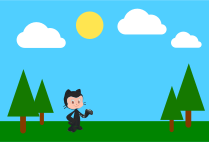

# Chapter 1: It's summer ☀

Mona loves summer, but she can't wait for winter to arrive so she can play on the snow with the
other octocats and build a beautiful snowman.

Let's help Mona by first setting up a self-hosted runner on GitHub Actions (use the
[`runner/start.sh`](./runner/start.sh) script to start a Docker container and then [set it
up](../../settings/actions/add-new-runner?arch=x64&os=linux) as a self-hosted runner for this
repository). After that, [create a new issue](../../issues/new) on the repository and refresh this
page.
